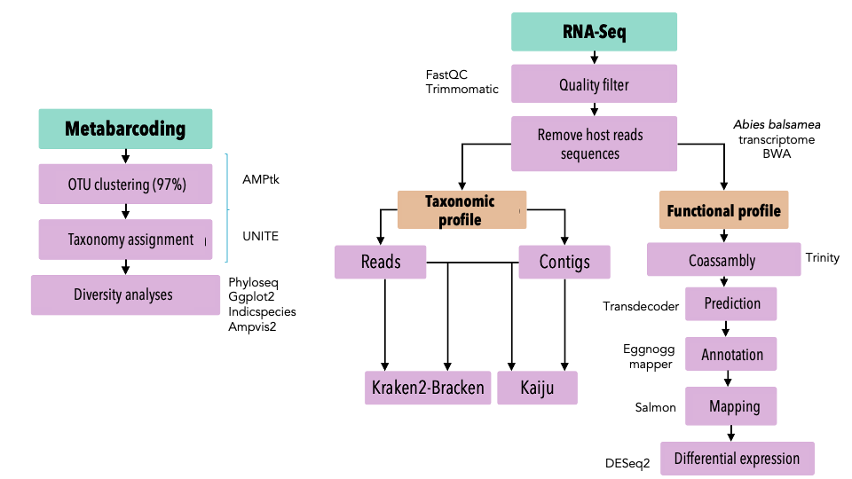

# <div align="center"> Foliar mycobiome communities remains unaltered under urban air-pollution but differentially express stress-related genes </div>


Air pollution by tropospheric ozone (O<sub>3</sub>) is causing the strong decline of sacred fir (*Abies religiosa*) populations in peripheral areas of Mexico City (de Bauer y Hernández-Tejeda, 2007). However, within high contaminated zones, variation in the level of damage to air pollution was detected among fir individuals. These results suggest that there is genetic variability related the presence of O<sub>3</sub>-related symptoms (Reyes-Galindo, 2019). Due to their effects on plant resistance to abiotic stresses, it is very likely that fungi present in fir leaves are involved in resistance to air pollution (Pan *et al.* 2017).

In this repository, you will find the workflow of a metatranscriptomics analysis from *Abies religiosa* indivuals exposed to high O<sub>3</sub> concentrations that showed 2 different phenotypes (symptomatic and asymptomatic). 

## **Aims**

1. To characterize the diversity of fungal endophytes inside asymptomatic and symptomatic sacred fir needles.
2. To detect differential expression of fungal genes from asymptomatic and symptomatic sacred fir needles. 
3. To identify fungal genes putitive involved in the abscence of visible foliar O<sub>3</sub>-related symptoms.

## **Prerequisites**

**Operative system**

Linux 4.19.0-10-amd64

**SOFTWARE**

* [**AMPtk v1.3.0**](https://amptk.readthedocs.io/en/latest/index.html)
* [**FastQC v0.11.8**](https://www.bioinformatics.babraham.ac.uk/projects/fastqc/)
* [**MultiQC v1.0.dev0**](https://multiqc.info/)
* [**BWA-MEM v0.7.17**](https://bio-bwa.sourceforge.net/)
* [**samtools-1.10**](https://samtools.sourceforge.net/)
* [**SPAdes v3.13.0**](https://github.com/ablab/spades)
* [**QUAST v5.0.2**](https://quast.sourceforge.net/)
* [**Trinity v2.8.5**](https://github.com/trinityrnaseq/trinityrnaseq/wiki)
* [**RSEM v1.3.3**](https://github.com/deweylab/RSEM)
* [**metaquast v3.2**](https://quast.sourceforge.net/metaquast.html)
* [**Kraken2 v.2.1.2**](https://ccb.jhu.edu/software/kraken2/)
* [**Bracken**](https://ccb.jhu.edu/software/bracken/)
* [**Kaiju v1.8.0**](https://bioinformatics-centre.github.io/kaiju/)
* [**TransDecoder v.5.5.0**](https://github.com/TransDecoder/TransDecoder)
* [**Salmon v1.8.0**](https://combine-lab.github.io/salmon/)

**R version**

R version 4.0.2

**R Libraries**

* **phyloseq** 
* **ggvenn v0.1.9** 
* **microbiome v1.13.12** 
* **vegan v2.5-7**
* **eulerr v6.1.1** 
* **gplot2 v3.4.2** 
* **DESeq2 v.40.1**
* **indicspecies v1.7.13** 
* **Ampvis2 v2.8.3**

## **Data**

The data comes from Veronica Reyes Galindo's project [***Abies* vs ozone**](https://github.com/VeroIarrachtai/Abies_vs_ozone). 

In this project **10** samples in total were used:

* **5** samples **Asymptomatic**.
* **5** samples **Symptomatic**.  

For more information about the samples see the file [**./RNA\_sacredfir.csv**](./RNA_sacredfir.csv)(modified from Reyes-Galindo's repository).

Where the columns:

* **Sample\_name\_RNA:** name with which the samples are identified. 
* **Sample\_name\_metabarcoding:** name with which the samples are identified. 
* **Condition:** tree condition (Symptomatic or asymptomatic).
* **Year:** year of sample collection.
* **Individual:** ID of tree of which needles were collected


## **Workflow**

We used metabarcoding an metatranscriptomics approaches as follow:



## **Repository structure**

This repository has the following structure:


```
.
├── LICENSE
├── README.md
├── RNA_sacredfir.csv
├── analyses
│   └── bin
│       ├── 1_CommunityComposition.R
│       ├── 2_SpecifiOTU.R
│       ├── 3_ObservedRichness.R
│       ├── 4_RelativeAbundance.R
│       ├── 5_Guild.R
│       ├── 6_DE.R
│       ├── assign_guild.R
│       └── metabarcoding_phyloseq.R
├── metabarcoding
│   └── bin
│       └── amptk.sh
├── metatranscriptomics
│   └── bin
│       ├── 01_quality.sh
│       ├── 02_removehost.sh
│       ├── 03_assembly.sh
│       ├── 04_krakenreads.sh
│       ├── 05_krakencontigs.sh
│       ├── 06_kaijureads.sh
│       ├── 07_kaijucontigs.sh
│       ├── 08_coassembly.sh
│       ├── 09_prediction.sh
│       ├── 10_mapping.sh
│       └── README.md
└── workflow.png

```

### `/analyses`
Folder with downstream analyses from metabarcoding and metatranscriptomics.

* **metabarcoding_phyloseq.R:** Script to parse classification outputs (Kaiju, Kraken-Bracken, and AMPtk)
* **assign_guild.R:** Function to asign guild to phyloseq objects.
* **1_CommunityComposition.R:** Script to visualize community composition with NMDS and ANOSIM test.
* **2_SpecifiOTU.R:** Script to evaluate IndVal with indicspecies.
* **3_ObservedRichness.R:** Script with GLM fitted to evaluate Observed richness by condition per dataset.
* **4_RelativeAbundance.R:** Script to parse phyloseq and visualize class relative abundance with heatmaps and log2FoldChange with DESeq2.
* **5_Guild.R:** Script to perform guild composition analyses.
* **6_DE.R:** Script to evaluate differential expression of ORFs.


### `/metabarcoding`
#### `/metatranscriptomics/bin`
Folder with scripts to perfor clustering and taxonomy assignment with AMPtk.

* **amptk.sh:** Script to perform clustering (97% simmilarity) and taxonomy assignment against UNITE database. 

### `/metatranscriptomics`
#### `/metatranscriptomics/bin`

Folder with the scripts to perform the transcriptmics analysis:

* **README.md**: Every step of the analysis explained and details extra steps as conda environments creation and databases preparation.
* **01_quality.sh:** Performs the quality analysis with FastQC and multiQC, adapters deletion and paired-end read merging with *Trimmomatic*.
* **02_removehost.sh:** Deletes host reads with BWA by mapping the paired and unpaired reads to the reference transcriptome and saves the unmapped reads (paired and unpaired) with *samtools*.
* **03_assembly.sh:** Perfors assembly of reads for each sample using metaSPADEs.
* **04_krakenreads.sh:** Makes a taxonomic profile from reads using *Kraken2* and estimates abundance with Bracken.
* **05_krakencontigs.sh:** Makes a taxonomic profile from contigs using *Kraken2* and estimates abundance with Bracken.
* **06_kaijureads.sh:** Makes a taxonomic profile from reads using *Kaiju*.
* **07_kaijucontigs.sh:** Makes a taxonomic profile from contigs using *Kaiju*.
* **08_coassembly.sh:** Performs a coassambly with every sample with Trinity.
* **09_prediction.sh:** Predicts ORFs using Transdecoder.
* **10_mapping.sh:** Estimate transcription of predicted ORF for every sample to coassebly using Salmon.
  

### Data availability

Raw data and parsed outputs to perform downstream analyses are not currently available in this repository. The content will remain hidden until publication. Once published the data will be available on [**OSF**](https://osf.io/xur7g/) (**TEMPORARELY PRIVATE PROJECT**). If you need the data or any other information, please contact: valeriaflores@ciencias.unam.mx. 


## **References**

* de Bauer, M. de L., y Hernández-Tejeda, T. (2007). A review of ozone- induced effects on the forests of central Mexico.
Environmental Pollution, 147: 446–453.
* Pan, F., Su, T. J., Cai, S. M., & Wu, W. (2017). Fungal endophyte-derived Fritillaria unibracteata var. wabuensis: diversity, antioxidant capacities in vitro and relations to phenolic, flavonoid or saponin compounds. Scientific reports, 7: 1-14.
* Reyes-Galindo, V. (2019). Análisis transcriptómico de la tolerancia a ozono troposférico en Abies religiosa (Tesis de
maestría). Universidad Nacional Autónoma de México. México.

